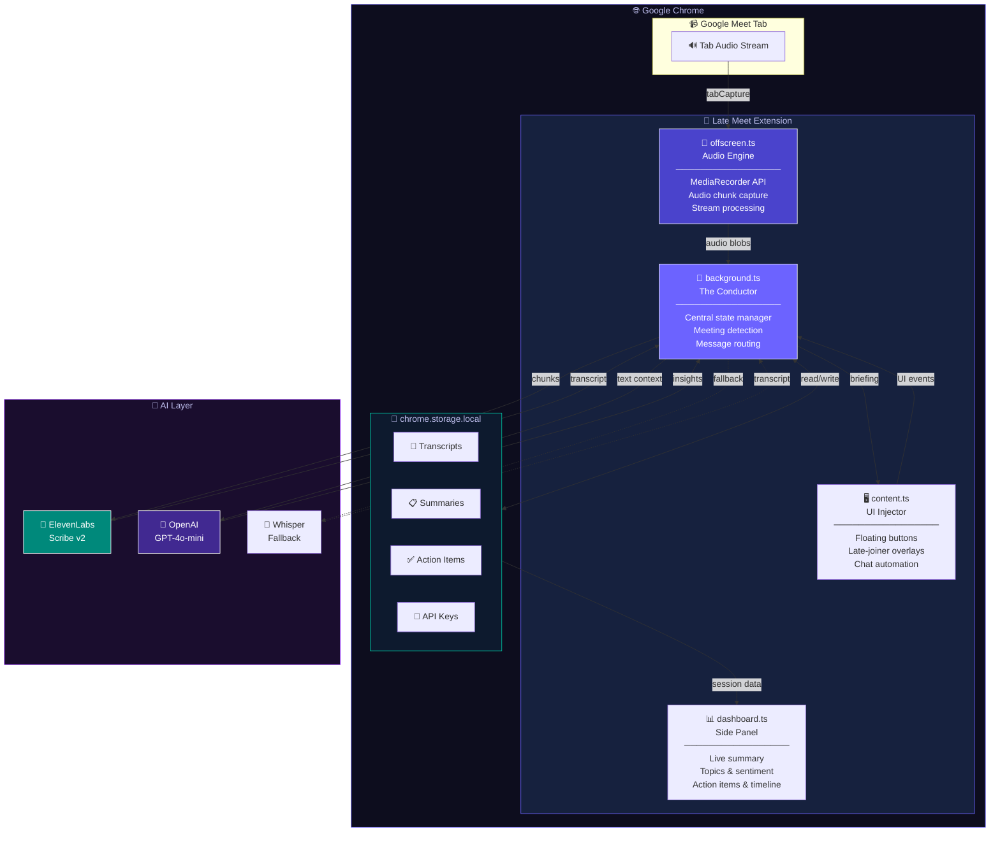
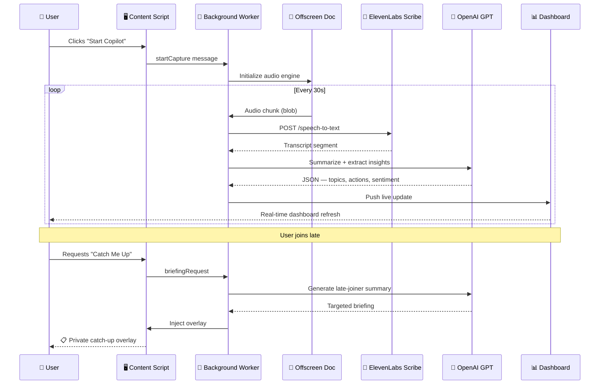
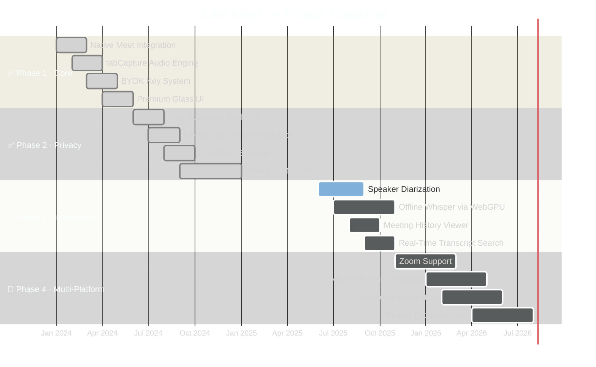

<div align="center">

<!-- ╔══════════════════════════════════════════════════════╗ -->
<!--              ANIMATED CAPSULE RENDER HEADER            -->
<!-- ╚══════════════════════════════════════════════════════╝ -->


<!-- ╔══════════════════════════════════════════════════════╗ -->
<!--                     ORIGINAL LOGO                      -->
<!-- ╚══════════════════════════════════════════════════════╝ -->


<br/>

<!-- ╔══════════════════════════════════════════════════════╗ -->
<!--                  TYPING SVG ANIMATION                  -->
<!-- ╚══════════════════════════════════════════════════════╝ -->
<a href="https://git.io/typing-svg">
  
</a>

<br/>

<!-- ══════════════ BADGE ROW 1 — Identity ══════════════ -->

[](https://gssoc.girlscript.tech/)
[](https://github.com/shouri123/Late-Meet/releases)
[](LICENSE)
[](CONTRIBUTING.md)
[](https://github.com/shouri123/Late-Meet)

<!-- ══════════════ BADGE ROW 2 — Activity ══════════════ -->

[](https://github.com/shouri123/Late-Meet/stargazers)
[](https://github.com/shouri123/Late-Meet/forks)
[](https://github.com/shouri123/Late-Meet/issues)
[](https://github.com/shouri123/Late-Meet/commits)

<!-- ══════════════ BADGE ROW 3 — Tech Stack ══════════════ -->

[](https://github.com/shouri123/Late-Meet)
[](https://vitejs.dev/)
[](https://developer.chrome.com/docs/extensions/mv3/)
[](https://openai.com/)
[](https://elevenlabs.io/)

<br/>

<!-- ══════════ HERO SCREENSHOT ══════════ -->


<br/><br/>

<!-- ══════════ QUICK NAV PILLS ══════════ -->

<a href="#-the-problem"></a>
<a href="#-our-solution"></a>
<a href="#-features"></a>
<a href="#-screenshots--workflow"></a>
<a href="#-architecture"></a>
<a href="#-installation"></a>
<a href="#-api-key-setup"></a>
<a href="#-tech-stack"></a>
<a href="#-security--privacy"></a>
<a href="#-roadmap"></a>
<a href="#-contributing--gssoc-2026"></a>
<a href="#-faq"></a>

</div>

---

> [!IMPORTANT]
> **Repository Scope:** This repo is dedicated exclusively to the **Late Meet Chrome Extension**.
> The website linked in project metadata is **not** part of this repository — please do not open issues about website UI/UX or bugs here.

---

## 📚 Table of Contents

- [The Problem](#the-problem)
- [Our Solution](#our-solution)
- [Features](#features)
- [Screenshots & Workflow](#screenshots--workflow)
- [Architecture](#architecture)
- [Project Structure](#project-structure)
- [Installation](#installation)
  - [Quick Install (For Regular Users)](#quick-install-for-regular-users)
  - [Developer Setup (For Contributors)](#developer-setup-for-contributors)
- [API Key Setup](#api-key-setup)
- [Tech Stack](#tech-stack)
- [Roadmap](#roadmap)
- [Contributing — GSSoC 2026](#contributing--gssoc-2026)
- [Documentation Hub](#documentation-hub)
- [Known Issues](#known-issues)
- [Extension Shortcuts](#extension-shortcuts)
- [Global Shortcuts](#global-shortcuts)
- [Security & Privacy](#security--privacy)
- [FAQ](#faq)
- [Community](#community)
- [License](#license)
- [Troubleshooting](#troubleshooting)

## 🌟 The Problem

<div align="center">
  
</div>

Joining a Google Meet late — or losing focus for just a moment — leaves you scrambling for context. Traditional AI note-takers make it **worse**:

<div align="center">

|                           |       Traditional AI Bots        |         **Late Meet**          |
| :------------------------ | :------------------------------: | :----------------------------: |
| 🤖 Participant Visibility |   ❌ "A Bot has joined" alert    |    ✅ Completely invisible     |
| ☁️ Data Privacy           | ❌ Transcripts on remote servers |   ✅ Local-only, zero upload   |
| 💸 Cost Model             |     ❌ Monthly subscription      |     ✅ BYOK — free to run      |
| 📜 Output Quality         |     ❌ Unreadable text walls     | ✅ Structured, punchy insights |
| 🔓 Open Source            |   ❌ Closed, audited by no one   |    ✅ MIT, fully auditable     |

</div>

---

## 💡 Our Solution

**Late Meet** is a **privacy-first, open-source Chrome Extension** that lives entirely inside your browser. No bots. No external servers. No subscriptions.

<div align="center">

```
  Join late  ──▶  Instant AI briefing  ──▶  Never miss context again
```

</div>

It uses **Chrome's native `tabCapture` API** to intercept audio without adding participants, feeds it through **ElevenLabs Scribe v2** for state-of-the-art transcription, and uses **OpenAI GPT** to generate structured, actionable intelligence — stored locally in `chrome.storage.local`.

---

## ✨ Features

<div align="center">

</div>

<br/>

<div align="center">

| Feature                        | What it does                                                                       |
| :----------------------------- | :--------------------------------------------------------------------------------- |
| 🤫 **Invisible Audio Capture** | Chrome's `tabCapture` + Offscreen Document APIs — no bot joins, no alert shown     |
| 🔤 **ElevenLabs Scribe STT**   | Industry-leading multilingual transcription with OpenAI Whisper fallback           |
| ⚡ **Late-Joiner Briefings**   | Join 10 min late → hit "Catch Me Up" → get a private AI summary of what you missed |
| 🧠 **Proactive Intelligence**  | Auto-detects Meet sessions, 1+N participant tracking, action-item extraction       |
| 🔑 **BYOK Model**              | Your ElevenLabs + OpenAI keys — zero vendor lock-in, zero subscriptions            |
| 💎 **Premium Glass UI**        | Deep-monochrome dashboard, glassmorphism, smooth animations                        |
| 🏠 **Local-First Storage**     | `chrome.storage.local` only — Save or Discard after each session                   |
| 🌍 **Multilingual**            | ElevenLabs Scribe handles multiple languages out of the box                        |

</div>

---

## 🖼️ Screenshots & Workflow

<div align="center">
  
</div>

<br/>

<details open>
<summary><b>🎬 Workflow Demo — End-to-End Walkthrough</b></summary>
<br/>

<div align="center">
  
  <br/><br/>
  <sub><i>End-to-end workflow demo — Loading the unpacked extension in Chrome, configuring API keys, joining Google Meet, starting the Copilot, and viewing the live side-panel dashboard.</i></sub>
</div>

</details>

<details>
<summary><b>📊 Dashboard — Real-time Side Panel</b></summary>
<br/>

<div align="center">
  
  <br/><br/>
  <sub><i>Live side-panel dashboard showing transcription, topics, action items, sentiment analysis, and speaker timelines.</i></sub>
</div>

</details>

<details>
<summary><b>⚡ Late-Joiner Briefing — Catch up Overlay</b></summary>
<br/>

<div align="center">
  
  <br/><br/>
  <sub><i>Floating meeting copilot injected cleanly onto Google Meet. Join late -> catch up instantly without adding noisy bots.</i></sub>
</div>

<details>
<summary><b>🔌 Extension Loaded in Chrome — Developer Mode Setup</b></summary>
<br/>

<div align="center">
  
  <br/><br/>
  <sub><i>Unpacked extension successfully loaded under Developer Mode in Chrome Extensions.</i></sub>
</div>

</details>

<details>
<summary><b>⚙️ Options Page — BYOK Key Configuration</b></summary>
<br/>

<div align="center">
  
  <br/><br/>
  <sub><i>Securely input your ElevenLabs and OpenAI API keys. Stored strictly in local browser storage — 100% private.</i></sub>
</div>

</details>

<details>
<summary><b>🔌 Extension Popup — Quick Action Control</b></summary>
<br/>

<div align="center">
  
  <br/><br/>
  <sub><i>One-click Copilot control, live recording duration timer, and direct access to options.</i></sub>
</div>

</details>

> 💡 Want to add screenshots or GIFs? It's the single most impactful contribution you can make. Check out [Issue #102](https://github.com/shouri123/Late-Meet/issues/102) — beginner-friendly and fully guided.

---

## 🏗️ Architecture

<div align="center">
  
</div>

### System Overview



### Data Flow — Sequence Diagram



> 📖 Full technical deep-dive: [`docs/ARCHITECTURE.md`](docs/ARCHITECTURE.md)

---

## 📁 Project Structure

```
Late-Meet/
├── .github/                    ← 🤖 CI/CD & Issue templates
│   ├── ISSUE_TEMPLATE/
│   └── workflows/              ← Lint · format · stale management
│
├── docs/                       ← 📚 Technical documentation
│   └── ARCHITECTURE.md
│
├── src/                        ← 🧠 Extension source (TypeScript)
│   ├── icons/                  ← Branding assets
│   ├── utils/
│   │   ├── api.ts              ← ElevenLabs & OpenAI client wrappers
│   │   └── prompts.ts          ← GPT prompt templates
│   ├── background.ts           ← 🎼 The Conductor (service worker)
│   ├── content.ts              ← 🖥️ UI injector (content script)
│   ├── dashboard.ts            ← 📊 Real-time side panel
│   ├── offscreen.ts            ← 🎵 Audio engine (offscreen doc)
│   ├── options.ts              ← ⚙️ BYOK key configuration
│   ├── popup.ts                ← Quick-action popover
│   └── types.ts                ← Shared TypeScript interfaces
│
├── package.json
├── tsconfig.json
├── vite.config.ts
├── CHANGELOG.md
├── CONTRIBUTING.md
├── ROADMAP.md
└── SECURITY.md
```

---

## ⚙️ Installation

<div align="center">
  
</div>

### Quick Install (For Regular Users)

No coding or terminal required! Get the extension running in under a minute.

1. Go to the [Releases page](https://github.com/shouri123/Late-Meet/releases) and download the latest `Late-Meet.zip` (or `dist.zip`) file.
2. Extract/Unzip the downloaded file on your computer.
3. Open Chrome and navigate to `chrome://extensions/`.
4. Toggle **Developer mode** ON (top right corner).
5. Click **Load unpacked** and select the unzipped folder.
6. That's it! Proceed to the **API Key Setup** below.

---

### 💻 Developer Setup (For Contributors)

Want to build from source or contribute to the codebase?

**Prerequisites:**

- Chrome 116+ (Native Side Panel API required)
- Node.js v18+ (LTS recommended)
- npm v9+

**① Clone the repository**

```bash
git clone https://github.com/shouri123/Late-Meet.git
cd Late-Meet

```

**② Install & Build**

```bash
npm install
npm run build
# Compiles TypeScript → bundles into dist/

```

**③ Load into Chrome**

```text
chrome://extensions  →  Developer Mode ✓  →  Load Unpacked  →  select dist/

```

> ⚠️ Always load the `dist/` folder — never `src/` or the project root.

**Dev Scripts**

```bash
npm run build        # Production build → dist/
npm run dev          # Watch mode (dev build)
npm run lint         # ESLint checks
npm run format       # Prettier auto-format
npm run type-check   # TypeScript validation

```

> 💡 **For a detailed developer setup guide with screenshots, check out the [`docs/GETTING_STARTED.md`](docs/GETTING_STARTED.md) guide.**

```

```

## 🔑 API Key Setup

<div align="center">
  
</div>

<br/>

Late Meet uses a **Bring Your Own Key (BYOK)** model. You connect your own accounts — we never see your keys.

> 🔑 **For provider checklists, troubleshooting, and detailed setup tips, read the full [`docs/API_KEYS.md`](docs/API_KEYS.md) integration guide.**

<details>
<summary><b>Step 1 — Get your ElevenLabs API Key (Speech-to-Text)</b></summary>
<br/>

ElevenLabs powers high-accuracy multilingual transcription via Scribe v2.

```
1. Go to  →  elevenlabs.io  →  Sign up free
2. Click your avatar  →  Profile + API Key
3. Click "Generate API Key"  →  name it "late-meet"  →  copy it
```

> 💡 The **free tier** includes generous monthly transcription minutes. Most users never exceed it for regular meeting usage.

</details>

<details>
<summary><b>Step 2 — Get your OpenAI API Key (Summaries & Intelligence)</b></summary>
<br/>

OpenAI powers meeting summaries, action item extraction, sentiment analysis, and late-joiner briefings.

```
1. Go to  →  platform.openai.com  →  Sign in
2. Left sidebar  →  API Keys  →  "+ Create new secret key"
3. Name it "late-meet"  →  copy the key immediately
```

> 💰 **Cost estimate:** Late Meet uses `gpt-4o-mini`. A typical 1-hour meeting costs **~$0.01–$0.05** total.

</details>

<details>
<summary><b>Step 3 — Enter keys into the extension</b></summary>
<br/>

```
1. Click the Late Meet icon in your Chrome toolbar
2. Click "Options"  (or right-click icon → Options)
3. Paste your ElevenLabs API Key
4. Paste your OpenAI API Key
5. Click Save  ✓
```

> 🔒 Keys are stored in `chrome.storage.local` on your machine only. They are only ever sent to your own ElevenLabs / OpenAI endpoints — never to us.

</details>

---

## 🛠️ Tech Stack

<div align="center">

|      Layer       |                                                       Technology                                                        | Purpose                                  |
| :--------------: | :---------------------------------------------------------------------------------------------------------------------: | :--------------------------------------- |
|   **Language**   |                  | Type-safe development                    |
|    **Build**     |                        | Fast, modern extension bundling          |
|  **Extension**   |            | Latest Chrome extension architecture     |
|    **Audio**     |      | Bot-free browser-level audio capture     |
| **STT Primary**  |            | Multilingual high-accuracy STT           |
| **STT Fallback** |            | Reliable transcription fallback          |
|   **AI / LLM**   |                  | Summarization & structured insights      |
|   **Storage**    |  | Local-first, zero BaaS dependencies      |
|   **Styling**    |                    | Glassmorphism + monochrome design system |
|   **Quality**    |     | Code quality & consistency               |
|  **Git Hooks**   |               | Pre-commit quality gates                 |

</div>

---

## 🗺️ Roadmap

<div align="center">
  
</div>



<details>
<summary><b>✅ Phase 1 — Core Foundation (Complete)</b></summary>

- [x] Native Google Meet integration — zero bot participants
- [x] Real-time audio capture via Chrome Offscreen + tabCapture APIs
- [x] Premium monochrome glassmorphism UI with side panel
- [x] BYOK integration for ElevenLabs + OpenAI
- [x] Late-joiner briefing overlays

</details>

<details>
<summary><b>✅ Phase 2 — Privacy Overhaul (Complete)</b></summary>

- [x] Full removal of Supabase and all BaaS dependencies
- [x] Local-first session management with `chrome.storage.local`
- [x] ElevenLabs Scribe v2 STT integration
- [x] Intelligent rolling LLM context prompting
- [x] GSSoC 2026 contributor infrastructure

</details>

<details>
<summary><b>🔄 Phase 3 — Intelligence Expansion (In Progress)</b></summary>

- [ ] Speaker diarization — who said what, tracked precisely
- [ ] Offline transcription via local Whisper / WebGPU
- [ ] Meeting history viewer with export
- [ ] Real-time keyword search and highlighting
- [ ] API cost & token usage tracker (local-first)
- [ ] Action item assignee auto-routing

</details>

<details>
<summary><b>🔮 Phase 4 — Multi-Platform (Planned)</b></summary>

- [ ] Zoom support — full feature parity
- [ ] Microsoft Teams support — enterprise ready
- [ ] On-the-fly translation during calls
- [ ] Firefox extension port

</details>

---

## 🤝 Contributing — GSSoC 2026

<div align="center">

[](https://gssoc.girlscript.tech/)

**Late Meet is proudly part of GirlScript Summer of Code 2026!**

> 🟢 **New to the project? Read the full [`docs/CONTRIBUTOR_GUIDE.md`](docs/CONTRIBUTOR_GUIDE.md) to understand onboarding, branch conventions, PR templates, and workflow diagrams.**

> ⭐ **Star this repo before contributing** — it helps us grow!

</div>

### Contribution Workflow

```bash
# 1. Fork & clone your fork
git clone https://github.com/YOUR_USERNAME/Late-Meet.git && cd Late-Meet

# 2. Create a feature branch
git checkout -b feature/your-feature-name

# 3. Make your changes, then run all checks:
npm run format        # auto-fix formatting
npm run lint          # must return zero errors
npm run type-check    # must compile cleanly

# 4. Commit with a descriptive message
git commit -m "feat: add real-time transcript search (#107)"

# 5. Push and open a PR on GitHub
git push origin feature/your-feature-name
```

### Open Issues by Difficulty

<!-- START_ISSUE_TABLES -->
<div align="center">

#### 🟢 Beginner — `level-1`

_No open issues for this level right now! Stay tuned._

#### 🟡 Intermediate — `level-2`

|                             #                             | Title                                                                                    | Skills  |
| :-------------------------------------------------------: | :--------------------------------------------------------------------------------------- | :------ |
| [#412](https://github.com/shouri123/Late-Meet/issues/412) | \[Enhancement\] Add support for Google Meet breakout room transcription                  | General |
| [#410](https://github.com/shouri123/Late-Meet/issues/410) | \[Bug\] \`background.ts\` service worker fails to restart after Chrome updates extension | General |

#### 🔴 Advanced — `level-3`

|                             #                             | Title                                                                               | Skills  |
| :-------------------------------------------------------: | :---------------------------------------------------------------------------------- | :------ |
| [#411](https://github.com/shouri123/Late-Meet/issues/411) | \[Performance\] \`speakerAttribution.ts\` allocates new arrays on every audio frame | General |

</div>
<!-- END_ISSUE_TABLES -->

### PR Checklist

Before submitting, verify all boxes:

- [ ] `npm run format` — zero formatting issues
- [ ] `npm run lint` — zero ESLint errors
- [ ] `npm run type-check` — TypeScript compiles cleanly
- [ ] `npm run build` — `dist/` builds successfully
- [ ] Issue number referenced in PR title (e.g. `fix: #73 validate past date inputs`)
- [ ] PR template filled out completely
- [ ] Screenshots/GIFs included for any UI changes

---

## 📚 Documentation Hub

<div align="center">

|                           Doc                            | Description                                      |
| :------------------------------------------------------: | :----------------------------------------------- |
|                 [`README.md`](README.md)                 | 📖 Project overview & quick start (you are here) |
|   [`docs/GETTING_STARTED.md`](docs/GETTING_STARTED.md)   | 🚀 **Getting Started & Installation Guide**      |
|          [`docs/API_KEYS.md`](docs/API_KEYS.md)          | 🔑 **API Keys Integration & BYOK Guide**         |
|           [`docs/PRIVACY.md`](docs/PRIVACY.md)           | 🛡️ **Privacy & Local-First Storage Details**     |
|   [`docs/TROUBLESHOOTING.md`](docs/TROUBLESHOOTING.md)   | 🔧 **Troubleshooting Common Errors**             |
|          [`docs/WORKFLOW.md`](docs/WORKFLOW.md)          | 🎬 **End-to-End Product Workflow & Journey**     |
|      [`docs/ARCHITECTURE.md`](docs/ARCHITECTURE.md)      | 🏗️ System design & technical deep-dive           |
|           [`CONTRIBUTING.md`](CONTRIBUTING.md)           | 🤝 Full contribution guidelines                  |
| [`docs/CONTRIBUTOR_GUIDE.md`](docs/CONTRIBUTOR_GUIDE.md) | 🟢 **GSSoC Contributor Onboarding Guide**        |
|                [`ROADMAP.md`](ROADMAP.md)                | 🗺️ Detailed feature roadmap                      |
|              [`CHANGELOG.md`](CHANGELOG.md)              | 📝 Version history & release notes               |
|           [`IMPROVEMENTS.md`](IMPROVEMENTS.md)           | 💡 Ideas & enhancement backlog                   |
|               [`SECURITY.md`](SECURITY.md)               | 🔒 Security policy & responsible disclosure      |
|                [`SUPPORT.md`](SUPPORT.md)                | 💬 How to get help                               |
|        [`CODE_OF_CONDUCT.md`](CODE_OF_CONDUCT.md)        | 🌟 Community standards                           |
|                  [`STATE.md`](STATE.md)                  | 📊 Extension state machine documentation         |

</div>

---

## 🐛 Known Issues

<div align="center">

|   Status    |                         Issue                         | Description                                                                          |
| :---------: | :---------------------------------------------------: | :----------------------------------------------------------------------------------- |
| ✅ Resolved | [#1](https://github.com/shouri123/Late-Meet/issues/1) | Audio capture intermittent failure after migration from Whisper to ElevenLabs Scribe |

</div>

> 🐛 Found a new bug? Use our [Bug Report template](https://github.com/shouri123/Late-Meet/issues/new/choose) to open a structured report.

---

## Extension Shortcuts

Control Late Meet without touching your mouse — perfect for accessibility and power users.

| Shortcut       | Mac           | Action                   |
| :------------- | :------------ | :----------------------- |
| `Ctrl+Shift+S` | `Cmd+Shift+S` | Toggle recording on/off  |
| `Ctrl+Shift+P` | `Cmd+Shift+P` | Open the side panel      |
| `Ctrl+Shift+Y` | `Cmd+Shift+Y` | Save the current session |

> The save-session shortcut was changed from `Ctrl+Shift+W` / `Cmd+Shift+W` because that combination is reserved by Chrome for closing windows. Shortcuts can be customized at `chrome://extensions/shortcuts`.

---

## 🔒 Security & Privacy

<div align="center">
  
</div>

<br/>

<div align="center">

```
  ╔═══════════════════════════════════════════════════════╗
  ║                                                       ║
  ║   🔑  BYOK — your keys, your data, your control      ║
  ║   💾  chrome.storage.local — zero cloud upload       ║
  ║   🤫  tabCapture — no bot joins the call             ║
  ║   🚫  No Supabase, no BaaS, no external DB           ║
  ║   ✅  MIT licensed — fully auditable by anyone       ║
  ║                                                       ║
  ╚═══════════════════════════════════════════════════════╝
```

</div>

<div align="center">

| Guarantee                   | How It's Enforced                                                                    |
| :-------------------------- | :----------------------------------------------------------------------------------- |
| 🔑 **Bring Your Own Key**   | You supply API keys — we have no access to your credentials, ever                    |
| 💾 **Local-only storage**   | All data stays in `chrome.storage.local` on your device — zero cloud                 |
| 🤫 **No bots, no presence** | `chrome.tabCapture` captures audio at browser level — other participants see nothing |
| 🚫 **No telemetry**         | Zero analytics, zero usage reporting, zero tracking of any kind                      |
| 🗑️ **You control deletion** | Every session ends with Save or Discard — your explicit choice                       |
| 🌐 **Minimal network**      | Only your own API key calls leave the browser (ElevenLabs / OpenAI)                  |
| 🔓 **Fully auditable**      | MIT licensed — read every line of source code yourself                               |

</div>

Late Meet's **Privacy-First Architecture** guarantees:

> 🛡️ **For detailed information on data flow, local encryption, and what data may leave the browser, check the [`docs/PRIVACY.md`](docs/PRIVACY.md) document.**

- **BYOK** — you supply your own API keys; they never leave your device
- **Local-only storage** — `chrome.storage.local`, no third-party DB
- **Invisible capture** — `tabCapture` operates at browser level; other participants see nothing
- **No BaaS** — Supabase removed completely in Phase 2

> **⚠️ Found a security vulnerability?** Do **not** open a public issue.
> Email privately: **chakrabortyshouri@gmail.com**
> See [`SECURITY.md`](SECURITY.md) for our responsible disclosure policy.

---

## ❓ FAQ

<details>
<summary><b>Does Late Meet add a bot to my Google Meet call?</b></summary>

No. Late Meet uses Chrome's native `tabCapture` API to capture audio at the browser level. Other meeting participants will never see any bot, notification, or indication that Late Meet is active.

</details>

<details>
<summary><b>Where is my meeting data stored?</b></summary>

All meeting data — transcripts, summaries, action items — is stored exclusively in `chrome.storage.local` on your device. Nothing is uploaded to any server. At the end of each session, you choose to **Save** or **Discard** the data.

</details>

<details>
<summary><b>Do I need to pay for Late Meet?</b></summary>

Late Meet itself is **100% free and open-source (MIT)**. You only pay for your own API usage via your ElevenLabs and OpenAI accounts. ElevenLabs offers a free tier, and `gpt-4o-mini` is very affordable (~$0.01–$0.05 per 1-hour meeting).

</details>

<details>
<summary><b>Which Chrome version is required?</b></summary>

Chrome **116 or higher** is required for the native Side Panel API. Check `chrome://version/` if unsure — most users are already far beyond this version.

</details>

<details>
<summary><b>Does it support Zoom or Microsoft Teams?</b></summary>

Not yet. Late Meet currently supports **Google Meet only**. Zoom and Teams support are planned for **Phase 4** of the roadmap. Contributions toward this are very welcome!

</details>

<details>
<summary><b>What languages does Late Meet transcribe?</b></summary>

ElevenLabs Scribe v2 handles **multiple languages** out of the box including English, Spanish, French, German, Hindi, Mandarin, Japanese, Portuguese, Arabic, and many more. The OpenAI Whisper fallback covers 50+ languages. See [ElevenLabs documentation](https://elevenlabs.io/docs) for the full list.

</details>

<details>
<summary><b>Transcription isn't starting — what should I check?</b></summary>

1. Confirm Chrome 116+ → check at `chrome://settings/help`
2. Verify your **ElevenLabs API key** is entered correctly in Options
3. Make sure you clicked **Start Copilot** _after_ joining the Meet — not before
4. Reload the extension at `chrome://extensions/` → click the refresh icon → rejoin
5. Check the [Issues board](https://github.com/shouri123/Late-Meet/issues) for known audio capture bugs

> 🔧 **For a complete troubleshooting matrix with common setup, build, runtime, and provider issues, check out the [`docs/TROUBLESHOOTING.md`](docs/TROUBLESHOOTING.md) guide.**

</details>

<details>
<summary><b>How do I delete my meeting data?</b></summary>

After every session, Late Meet prompts **Save** or **Discard**. Choosing Discard immediately clears all transcripts and summaries from `chrome.storage.local`. You can also manually clear extension storage via `chrome://settings/content/all` → find Late Meet → Clear data.

</details>

<details>
<summary><b>How do I report a bug or request a feature?</b></summary>

Use our GitHub Issue templates:

- 🐛 [Bug Report](https://github.com/shouri123/Late-Meet/issues/new?template=bug_report.md)
- 💡 [Feature Request](https://github.com/shouri123/Late-Meet/issues/new?template=feature_request.md)

For security issues, email privately to `chakrabortyshouri@gmail.com`.

</details>

<details>
<summary><b>I'm a GSSoC 2026 contributor — how do I start?</b></summary>

1. ⭐ Star this repository
2. Browse [Issues](https://github.com/shouri123/Late-Meet/issues) for `gssoc`-tagged issues
3. Comment on your chosen issue requesting assignment
4. Wait for a maintainer to assign you before starting work
5. Fork → Branch → Code → PR following our [Contributing Guide](CONTRIBUTING.md)

</details>

---

## 🌐 Community

<div align="center">

[](https://github.com/shouri123/Late-Meet/discussions)
[](https://github.com/shouri123/Late-Meet/issues)
[](https://github.com/shouri123/Late-Meet/pulls)
[](https://gssoc.girlscript.tech/)

### Contributors

[](https://github.com/shouri123/Late-Meet/graphs/contributors)

### Star History

[](https://star-history.com/#shouri123/Late-Meet&Date)

</div>

---

## 📜 License

Distributed under the **MIT License**. See [`LICENSE`](LICENSE) for full details.

```
MIT License — Copyright (c) 2024 Shouri Chakraborty

Permission is hereby granted, free of charge, to any person obtaining a copy
of this software and associated documentation files (the "Software"), to deal
in the Software without restriction...
```

---

<!-- ╔══════════════════════════════════════════════════════╗ -->
<!--              ANIMATED CAPSULE RENDER FOOTER            -->
<!-- ╚══════════════════════════════════════════════════════╝ -->

<div align="center">


<br/>

[](https://github.com/shouri123/Late-Meet/stargazers)
[](https://github.com/shouri123/Late-Meet/forks)
[](https://github.com/shouri123/Late-Meet/watchers)

<br/>

_Made with 🖤 by the Late Meet community · [Report Bug](https://github.com/shouri123/Late-Meet/issues/new?template=bug_report.md) · [Request Feature](https://github.com/shouri123/Late-Meet/issues/new?template=feature_request.md) · [Join GSSoC 2026](https://gssoc.girlscript.tech/)_

</div>

---

## Troubleshooting

| Issue                                    | Cause                                     | Fix                                                          |
| ---------------------------------------- | ----------------------------------------- | ------------------------------------------------------------ |
| Transcription not starting               | Microphone permission denied              | Click the lock icon in Chrome address bar → Allow Microphone |
| Extension popup shows "Not in a meeting" | Tab is not a Google Meet tab              | Navigate to meet.google.com first                            |
| API key error                            | Key not set or expired                    | Open extension Options and re-enter your API key             |
| Transcript stops mid-meeting             | Chrome service worker restarted           | Refresh the Meet tab and restart recording                   |
| Speaker names show as "Unknown"          | Non-ASCII names or Google Meet DOM change | Update the extension to the latest version                   |
| Storage quota exceeded                   | Too many saved meetings                   | Open the dashboard and delete old sessions                   |

---

## Global Shortcuts

| Shortcut      | Action                       |
| ------------- | ---------------------------- |
| `Alt+Shift+R` | Start / Stop recording       |
| `Alt+Shift+P` | Pause / Resume transcription |
| `Alt+Shift+S` | Generate meeting summary     |
| `Alt+Shift+E` | Export transcript            |

> **Note:** Shortcuts can be customized at `chrome://extensions/shortcuts`
