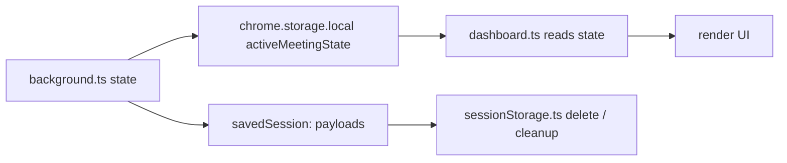

# Architecture

Late Meet is a **Manifest V3 Chrome Extension** built with TypeScript and Vite 5. It captures meeting audio directly from the browser tab, transcribes it using AI, and presents real-time intelligence through a side panel dashboard — all without adding bots to your call.

## High-Level Overview


[](https://htmlpreview.github.io/?https://github.com/shouri123/Late-Meet/blob/main/docs/assets/diagrams/architecture.html)

## Core Components

| Component                     | File(s)                                           | Responsibility                                                                                                                                                    |
| ----------------------------- | ------------------------------------------------- | ----------------------------------------------------------------------------------------------------------------------------------------------------------------- |
| **Background Service Worker** | `background.ts`                                   | Central state machine. Detects Meet tabs, routes audio to STT APIs, coordinates LLM summarization, manages session lifecycle, and handles participant tracking.   |
| **Offscreen Audio Engine**    | `offscreen.ts`, `offscreen.html`                  | Runs a hidden offscreen document for `chrome.tabCapture`. Captures audio via `MediaRecorder`, processes chunks, and forwards blobs to the background worker.      |
| **Content Script**            | `content.ts`, `content.css`                       | Injects floating UI elements into Google Meet pages. Handles the "Start Copilot" button, late-joiner briefing overlays, and chat automation for welcome messages. |
| **Side Panel Dashboard**      | `dashboard.ts`, `dashboard.html`, `dashboard.css` | Real-time intelligence display. Shows live summary, topics, decisions, action items, sentiment analysis, and meeting timeline.                                    |
| **Popup**                     | `popup.ts`, `popup.html`, `popup.css`             | Quick-access extension controls. Start/stop copilot, view meeting status, navigate to dashboard.                                                                  |
| **Options Page**              | `options.ts`, `options.html`, `options.css`       | API key configuration and local preferences. Users enter their ElevenLabs and OpenAI keys (BYOK model).                                                           |
| **Storage Utilities**         | `sessionStorage.ts`, `utils/storageUtils.ts`      | Session persistence, storage metrics, cleanup functions, legacy support, and local storage quotas.                                                                |
| **AI Prompts + Processing**   | `utils/prompts.ts`, `utils/api.ts`                | Prompt construction and provider wrappers for OpenAI / ElevenLabs validation and transcription.                                                                   |
| **Type Definitions**          | `types.ts`                                        | TypeScript interfaces for meeting state, participants, timeline entries, transcript chunks, and analytics.                                                        |

## 🔄 Data Flow

Every meeting session follows this end-to-end pipeline — from the moment you join a call to the final dashboard output.

| Step | Component                   | Action                                                                       |
| :--: | --------------------------- | ---------------------------------------------------------------------------- |
|  1   | 🌐 **Google Meet tab**      | User joins a meeting                                                         |
|  2   | 📄 **Content script**       | Detects meeting → injects **Start Copilot** button                           |
|  3   | 👆 **User**                 | Clicks Start → message sent to background worker                             |
|  4   | ⚙️ **Background**           | Creates offscreen document → begins `tabCapture` stream                      |
|  5   | 🎙️ **Offscreen document**   | Captures audio chunks via `MediaRecorder` → produces blobs                   |
|  6   | 🔊 **ElevenLabs Scribe**    | Receives audio blobs → returns transcribed text (Whisper fallback if needed) |
|  7   | 📝 **Background**           | Appends transcript → maintains rolling context window                        |
|  8   | 🤖 **OpenAI GPT**           | Processes transcript → generates structured intelligence                     |
|  9   | 💾 **chrome.storage.local** | Structured results saved locally                                             |
|  10  | 📊 **Side panel dashboard** | Polls storage → renders live updates                                         |
|  11  | ✅ **User**                 | Meeting ends → chooses **Save** or **Discard**                               |

## Project Structure

The codebase is organized around extension layers and domain concerns.

- `src/` — extension source code.
  - `background.ts` — MV3 service worker orchestrating state, audio capture, and AI work.
  - `offscreen.ts` / `offscreen.html` — hidden document used for `chrome.tabCapture` and `MediaRecorder` audio processing.
  - `content.ts` / `content.css` — Google Meet page integration, floating UI injection, and meeting detection.
  - `dashboard.ts` / `dashboard.html` / `dashboard.css` — side panel dashboard rendering, state consumption, and dashboard interactions.
  - `popup.ts` / `popup.html` / `popup.css` — quick extension controls and status display.
  - `options.ts` / `options.html` / `options.css` — user settings, API credential entry and validation.
  - `utils/` — reusable helpers for API calls, credentials encryption, prompts, and storage metrics.
  - `types.ts` — shared TypeScript interfaces used across components.

- `docs/` — contributor-facing architecture, workflow, and troubleshooting documentation.

- `manifest.json` — Chrome extension metadata, permissions, commands, and side panel configuration.

- `package.json` / `vite.config.ts` — build tooling and extension packaging configuration.

## Audio Capture Flow

Late Meet separates audio capture into two layers to satisfy MV3 constraints.

1. **Meet Detection** (`content.ts`)
   - Detects a Google Meet page using URL pattern matching (`meet.google.com/*`).
   - Injects the Start Copilot UI overlay and sends meeting state updates to `background.ts`.

2. **Capture Initialization** (`background.ts`)
   - Receives a user command to start Copilot from the popup or content script.
   - Creates or reactivates an offscreen document via `chrome.offscreen.createDocument`.
   - Uses `chrome.tabCapture.getMediaStreamId` with the Meet tab ID, then forwards that stream ID to `offscreen.ts`.

3. **Offscreen Processing** (`offscreen.ts`)
   - Opens a hidden page that can access DOM and media APIs.
   - Starts `MediaRecorder` on the captured audio stream.
   - Emits recorded audio chunks back to `background.ts` via runtime messages.

4. **Speech-to-Text Routing** (`background.ts`)
   - Receives audio chunks and decides whether to use ElevenLabs or OpenAI Whisper.
   - Sends audio blobs to the configured provider and awaits transcript results.
   - Appends transcript entries to the in-memory state and persists them if needed.

```mermaid
flowchart LR
  A[Google Meet tab] --> B[content.ts detect meeting]
  B --> C[background.ts start Copilot]
  C --> D[offscreen.ts create audio stream]
  D --> E[MediaRecorder captures chunks]
  E --> F[background.ts receives audio blobs]
  F --> G[STT provider (ElevenLabs/Whisper)]
  G --> H[Transcript state update]
```

## AI Processing Flow

Once transcript text arrives, the background worker coordinates analysis and summary generation.

- Each transcript chunk is added to the meeting state along with metadata like `chunkId`, `timestamp`, and `speaker`.
- `summarizeTranscriptIfNeeded()` wakes periodically based on user settings and the latest transcript activity.
- The prompt builder in `utils/prompts.ts` constructs a JSON-focused request for summary, topics, decisions, and actions.
- OpenAI GPT processes the transcript window and returns a structured JSON payload.
- Background logic merges new decisions, actions, and summary points into persistent state while avoiding duplicates.

### Structured AI Output

Late Meet expects the AI response to contain fields such as:

- `summary`
- `summaryItems`
- `topics`
- `decisions`
- `actionItems`
- `sentiment`
- `keyInsights`

This keeps the dashboard rendering code independent from raw AI responses.

## Storage Architecture

Late Meet uses `chrome.storage.local` as its single source of truth for saved sessions and settings.

- Active meeting state is stored under `activeMeetingState` and broadcast to UI components.
- Saved sessions are stored individually as `savedSession:<id>` keys with a separate index key `savedSessionIndex`.
- Legacy fallback support uses `savedSessions` for older releases.
- `utils/storageUtils.ts` computes storage usage, session sizes, and quota metrics.
- Bulk cleanup APIs in `sessionStorage.ts` remove saved payloads and keep the session index in sync.



## Dashboard Workflow

`dashboard.ts` is responsible for reading stored state and updating the UI.

- On load, it hydrates the latest meeting state from `background.ts` and `chrome.storage.local`.
- It only renders data; it does not perform core business logic such as transcription or summarization.
- Components like summary, decisions, and action items are updated when `background.ts` broadcasts state changes.
- The dashboard also exposes export functions and transcript navigation.

## Extension Lifecycle

The Late Meet lifecycle follows these phases:

1. **Install / first run**
   - `background.ts` registers commands and context menus.
   - If onboarding is not complete, first-run setup may be launched.

2. **Initialization**
   - The service worker hydrates state from `chrome.storage.local`.
   - UI components connect to the background with message listeners.

3. **Meeting detection**
   - `content.ts` detects Google Meet pages and reports status.
   - The user can start Copilot from the injected overlay or popup.

4. **Active session**
   - The background worker creates an offscreen document and begins audio capture.
   - Transcript, summary, and intelligence are generated live.

5. **Session completion**
   - The user may save, export, or discard the session.
   - Saved session state is persisted and available in storage dashboards.

## Privacy & Security Model

Late Meet is intentionally local-first.

- No project-managed databases or external session storage.
- Users provide their own OpenAI and ElevenLabs API keys.
- Persistent meeting data is stored locally on the user's device (`chrome.storage.local`).
- Audio/transcript content is transmitted only to user-configured providers (BYOK) for transcription/summarization.
- `chrome.storage.local` is the only persistent storage mechanism.

---

### What OpenAI GPT generates at Step 8

| Output              | Description                                          |
| ------------------- | ---------------------------------------------------- |
| 📋 **Summary**      | Concise overview of what was discussed               |
| 🏷️ **Topics**       | Key subjects and themes extracted from the meeting   |
| ✅ **Action items** | Tasks identified with implicit or explicit ownership |
| 🎯 **Decisions**    | Conclusions and commitments made during the meeting  |
| 💬 **Sentiment**    | Tone and confidence analysis across the conversation |

> 💡 **For contributors:** The separation of responsibilities must be preserved — audio work belongs in `offscreen.ts`, coordination in `background.ts`, and display logic in `dashboard.ts`. See [Contributor Guidelines](#-contributor-guidelines-for-architecture-changes) before making pipeline changes.

---

## 📡 Message Passing Flow

Late Meet components never call each other directly — they communicate exclusively through **Chrome runtime messages** and **local storage updates**. This keeps each component decoupled and testable in isolation.

### Communication Overview

| Sender          | Receiver               | Message Type        | Trigger                              |
| --------------- | ---------------------- | ------------------- | ------------------------------------ |
| `content.ts`    | `background.ts`        | Page status         | Meeting detected / page changed      |
| `popup.ts`      | `background.ts`        | User command        | Start / Stop copilot clicked         |
| `background.ts` | `offscreen.ts`         | Capture control     | Create / destroy audio stream        |
| `offscreen.ts`  | `background.ts`        | Status update       | Audio chunks ready / capture stopped |
| `background.ts` | `dashboard.ts`         | Intelligence update | New transcript / summary ready       |
| `options.ts`    | `chrome.storage.local` | Settings write      | API keys saved                       |
| `dashboard.ts`  | `chrome.storage.local` | Settings read       | Dashboard loads / refreshes          |

### Key Rules for Message Passing

> [!IMPORTANT]
> **Never call component functions directly.** All cross-component communication must go through `chrome.runtime.sendMessage` or `chrome.storage` updates. Direct imports between components break the MV3 architecture.

- **background.ts is the only hub** — all messages route through it, not directly between components
- **content.ts only sends, never receives** complex state — it detects and reports, background.ts decides
- **dashboard.ts only reads** — it should never write business logic back to background.ts
- **offscreen.ts is isolated** — it only talks to background.ts, never directly to content.ts or dashboard.ts
- **options.ts writes to storage directly** — it does not need to go through background.ts for settings saves

---

## Privacy Model

- **BYOK**: Users supply their own API keys. No shared credentials.
- **Local-only storage**: All data lives in `chrome.storage.local`. Zero cloud sync.
- **No telemetry**: No analytics, no tracking, no usage data collection.
- **Invisible**: No bot participant added to the meeting. Audio captured via Chrome's native `tabCapture` API.
- **User-controlled lifecycle**: Data can be discarded at any time.

## Technology Stack

| Category           | Technology                                                |
| ------------------ | --------------------------------------------------------- |
| Extension Platform | Chrome Manifest V3                                        |
| Language           | TypeScript                                                |
| Build Tool         | Vite 5 with `@crxjs/vite-plugin`                          |
| Styling            | Vanilla CSS (monochrome design system)                    |
| Storage            | `chrome.storage.local`                                    |
| Transcription      | ElevenLabs Scribe v2 (primary), OpenAI Whisper (fallback) |
| Summarization      | OpenAI GPT models (configurable)                          |
| Audio Capture      | Chrome `tabCapture` + Offscreen Documents API             |

## ⚙️ Manifest V3 Decisions

Late Meet is built exclusively for **Manifest V3** — the current and future standard for Chrome Extensions. MV3 introduces important architectural constraints that directly shape how Late Meet is designed.

### Service Worker Instead of Persistent Background Page

MV3 replaces the old persistent background page with an **event-driven service worker**. This means `background.ts` can be stopped by Chrome at any time when idle — it is not a permanently running process.

> **What this means for contributors:** Never rely on in-memory state surviving between events. Always persist important state to `chrome.storage.local` and re-read it when needed. Design message handlers to be stateless and self-contained.

### Offscreen Document for Media Work

Chrome's MV3 service workers cannot access media APIs like `MediaRecorder` or `chrome.tabCapture` directly — they require a document context. Late Meet solves this by spinning up a hidden **Offscreen Document** (`offscreen.ts`) whenever audio capture is needed.

> **What this means for contributors:** All audio capture and media processing must stay inside `offscreen.ts`. Do not attempt to move media work into the service worker — it will not work in MV3.

### Chrome-Specific APIs

Late Meet relies on Chrome-only APIs including `chrome.tabCapture`, `chrome.storage.local`, and `chrome.sidePanel`. These are intentional choices for the current Google Meet + Chrome implementation.

> **What this means for contributors:** Always verify that any new browser API you use is available in MV3 and check whether it requires new permissions in `manifest.json`. Document any new permission additions clearly in your PR.

## 🧭 Contributor Guidelines for Architecture Changes

> 📖 New to contributing? Start with the [Contributor Guide](CONTRIBUTOR_GUIDE.md) first for the full contribution workflow, then come back here for architecture-specific rules.

Before making any architecture-level change, read this section carefully. Late Meet follows a strict **separation of concerns** — each component owns a specific layer and should not bleed into others.

### ✅ Preferred Patterns

| Component              | Owns                                              |
| ---------------------- | ------------------------------------------------- |
| `content.ts`           | Page detection, UI injection, Meet page state     |
| `background.ts`        | Orchestration, message routing, session lifecycle |
| `offscreen.ts`         | Audio capture, MediaRecorder, stream processing   |
| `dashboard.ts`         | Display rendering, storage reads, live updates    |
| `popup.ts`             | Quick user actions, status display                |
| `options.ts`           | User configuration, API key management            |
| `chrome.storage.local` | All persistent session state                      |

### ❌ Patterns to Avoid

- **Long-running media work in the service worker** — use the Offscreen Document instead
- **Server-side storage for meeting data** — Late Meet is local-first; never add cloud persistence without an explicit project decision
- **Dashboard rendering logic in background.ts** — keep display concerns in `dashboard.ts`
- **Calling AI providers from multiple components** — all provider calls should be coordinated through `background.ts`
- **Adding new permissions silently** — every new `manifest.json` permission must be justified and documented in the PR

### 💡 General Advice

- When in doubt about where logic belongs, follow the existing message-passing pattern
- Keep components focused — if a file is growing too large, that's a signal to extract a utility
- Test message-passing changes on a real Google Meet tab, not just in isolation

## 🐛 Debugging Tips

Use Chrome's built-in extension tools when debugging architecture-level issues.

### Setup

1. Open `chrome://extensions`
2. Enable **Developer mode** (toggle in top-right)
3. Click **Load unpacked** → select the `dist/` folder
4. Use the **Inspect** links to open DevTools for each component

> 📽️ For a visual walkthrough of the full setup process, see [docs/DEMO.md](DEMO.md)

### Component-Specific Debugging

| Component       | How to inspect                                                               |
| --------------- | ---------------------------------------------------------------------------- |
| `background.ts` | Click **Service Worker** link on the extension card in `chrome://extensions` |
| `popup.ts`      | Right-click the extension icon → **Inspect popup**                           |
| `dashboard.ts`  | Open the side panel → right-click → **Inspect**                              |
| `options.ts`    | Open the options page → right-click → **Inspect**                            |
| `content.ts`    | Open DevTools on the Google Meet tab → **Console**                           |
| `offscreen.ts`  | Appears as a separate target in `chrome://inspect/#other`                    |

### Common Debugging Tips

- **Message-passing issues** — log the message `type`, `sender`, and intended destination at both ends
- **Storage issues** — use `chrome.storage.local.get(null, console.log)` in the service worker console to dump all stored keys
- **Audio capture issues** — always test on a real Google Meet tab; mock environments won't trigger `tabCapture` correctly
- **Service worker stopped** — if background logs aren't appearing, click **Service Worker** in `chrome://extensions` to wake it up
