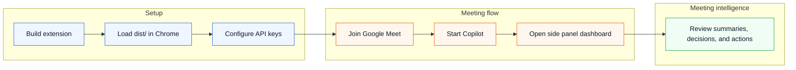
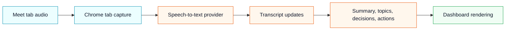

# Product Workflow

This guide shows the end-to-end Late Meet workflow, from installation to meeting intelligence.

## Workflow Overview

| Step | User Action                     | Late Meet Result                                         |
| ---- | ------------------------------- | -------------------------------------------------------- |
| 1    | Install and build the extension | A Chrome-loadable `dist/` folder is created              |
| 2    | Load unpacked extension         | Late Meet appears in `chrome://extensions`               |
| 3    | Configure API keys              | BYOK providers are ready for transcription and summaries |
| 4    | Join Google Meet                | Late Meet detects the meeting context                    |
| 5    | Start Copilot                   | Audio capture and meeting intelligence begin             |
| 6    | Open dashboard                  | Live summary, topics, decisions, and actions are shown   |
| 7    | Review output                   | User can catch up, export, save, or discard meeting data |

- First-time users may see a guided onboarding wizard during setup.
- Keyboard shortcuts allow quick meeting actions without leaving the Meet tab.
- Timestamp-linked transcript navigation helps users jump from summary items to exact transcript chunks.

## 1. Load the Extension

Build the project and load the generated `dist/` folder in Chrome.

## 2. Open the Extension Popup

Use the popup as the lightweight entry point for checking extension state and opening configuration.

## 3. Configure Provider Settings

Add your own ElevenLabs and OpenAI keys in the options page.

## 4. Join Google Meet and Start Copilot

When Late Meet detects a Meet session, the Start Copilot overlay appears inside the meeting interface.

## 5. Use the Meeting Intelligence Dashboard

The side panel gives a focused workspace for live meeting intelligence.

Dashboard areas include:

- Audio input status.
- Live summary.
- Current topic.
- Topics, decisions, action items, and people counters.
- Export summary action.

## 6. Live Transcription Flow

After Copilot starts, Late Meet captures tab audio through Chrome extension APIs and routes speech-to-text work through the configured provider. The dashboard should gradually reflect the active meeting state as transcript and intelligence updates become available.

## 7. Catch-Up Workflow

Late Meet is designed for users who join late or lose context during a call. The catch-up workflow should help the user understand the current meeting state without adding a bot participant or exposing private meeting data to a project-owned server.

Expected catch-up output includes:

- Current topic.
- Recent summary.
- Important decisions.
- Open action items.
- Participant or context signals when available.

## 8. Summary Generation

The side panel dashboard is the main place to review generated meeting intelligence. Before exporting or sharing any output, users should check the summary, decisions, and action items for sensitive content.

## 9. End-of-Meeting Review

Review the generated meeting intelligence before leaving the workflow:

- Live summary for the current meeting state.
- Topics for the main discussion areas.
- Decisions for confirmed outcomes.
- Action items for follow-up work.
- People counters and participant context when available.

## 10. Export or Save Summary

Use the dashboard export action when you need a copy of the meeting summary outside the live session. Before sharing exported content, review it for private meeting details and remove anything that should not leave the team.

## 11. End Meeting or Discard Data

When the meeting is finished, decide whether the session output should be saved, exported, or discarded. This keeps the workflow aligned with Late Meet's local-first privacy model.

- Use the Storage Usage Dashboard to inspect saved sessions, see storage quotas, and clean up old meeting data.

## Workflow Quality Checklist

- Screenshots show real extension states.
- Sensitive meeting names, codes, avatars, and account data are redacted.
- Documentation explains what the user should do and what they should expect to see.
- Setup, configuration, meeting usage, and dashboard review are all covered.
